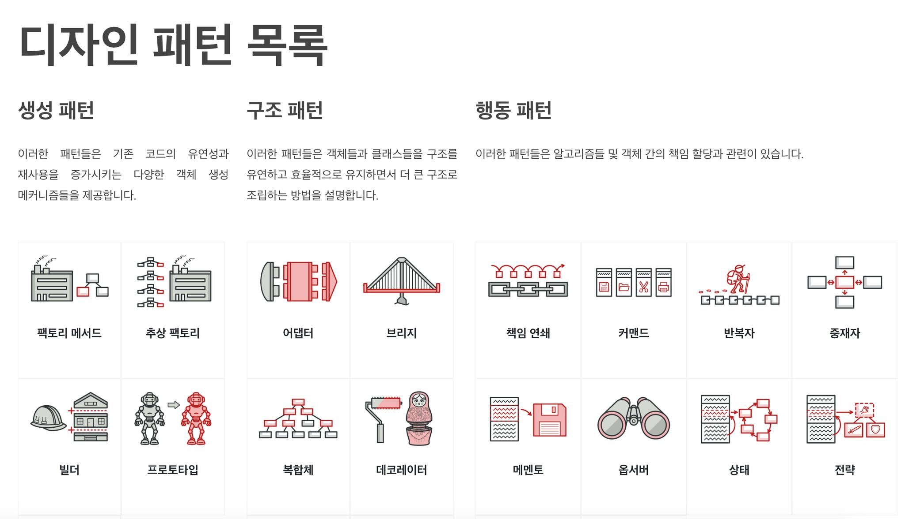
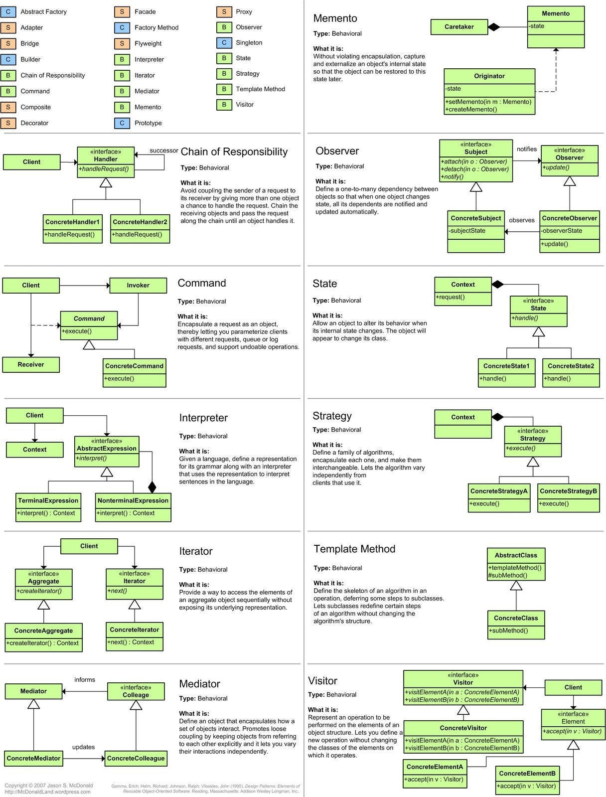
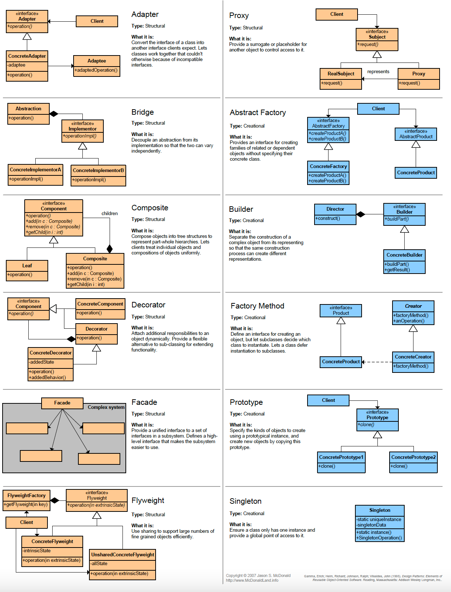

# Software Design & Architecture

[출처](https://www.freecodecamp.org/news/software-design/)

## Step 1. Clean Code
- class, function 작게 유지해라
- 주석보다 의미 있는 변수명, 메서드, 클래스명 작성
- 의미있는 테스트 코드 작성
- null 전달하지 않기

## Step 2. Programming Paradigms
- 객체 지향 프로그래밍으로 다형성과 플러그인을 사용하여 아키텍처의 경계를 수월히 넘을 수 있다.
- 함수형 프로그래밍은 클라이언트쪽으로 데이터를 수월히 전달할 수 있다.
- 구조화된 프로그래밍은 알고리즘을 작성하기 수월하다.

> 효과적인 프로그램은 위 3가지 패러다임을 적재적소에 혼합하여 사용한다.

## Step 3. Object-Oritented
- OOP는 각 패러다임이 어떻게 동작하는지, 코드를 구조화하도록 만드는 좋은 도구이다.
- OOP의 4가지 원칙은 우리의 프로그램을 유연하고 풍부한 도메인을 만든다. 
	- 다형성: animal - (dog, cat) 과 같은 것
	- 상속: 부모 클래스의 필드 및 기능을 물려받아 재사용 하는 것
	- 추상화: 추상 메서드를 포함한 클래스를 상속받은 자식 클래스는 반드시 추상 메서드를 재정의하여 구현하여야 한다.
	- 캡슐화: 클래스(변수, 메서드)의 구현으로 정보의 은닉을 보장하고 접근제어자(private, default, protected, public) 및 getter/setter의 구현으로 캡슐화를 제어할 수 있다.
- 

## Step 4. Design Principles
OOP는 풍부한 도메인의 캡슐화와 여러 문제점들을 해결해주지만 아래와 같은 디자인의 어려움을 도전 받는다.
- 언제 composition을 사용해야 하나?
> composition은 extends가 아닌 객체 주입으로 객체 간의 약한 결합도를 유지할 수 있게 한다.
- 언제 상속을 사용해야 하나?
- 언제 추상 클래스를 사용해야 하나?

- 숙지해야할 디자인 원칙
1. 상속 보다 composition
2. 캡슐화
3. 구체화가 아닌 추상화에 반대하는 프로그램
4. 헐리우드 원칙: 부르지 마라. 우리가 부른다.
5. SOLID 원칙, 특히 단일 책임의 원칙
6. DRY (Don't Repeat Yourself)) 반복하지 마라
7. YAGNI (You Aren't Gonna Need It) 필요하지 않을 것이다. 실제로 필요할 때까지 어떤 기능도 추가해서는 안된다.

> 결론은 너 스스로 결정해라. 누가 뭐라하든. 너에게 의미가 있다면.

## Step 5. Design Patterns
소프트웨어에서의 모든 문제는 이미 분류되어 해결 되었다.
우리는 이러한 패턴을 디자인 패턴이라고 부른다.

- 디자인 패턴의 3가지 분류
1. 생성: 객체가 생성되는 방식을 제어하는 것
	1. 싱글톤 패턴: 단일 인스턴스만 존재
	2. 추상 팩토리 패턴: 구상 클래스에 의존하지 않고도 서로 연관되거나 의존적인 객체로 이루어진 제품군을 생산하는 인터페이스를 제공하는 디자인 패턴
	3. 프로토타입 패턴: 코드를 그들의 클래스들에 의존시키지 않고 기존 객체들을 복사할 수 있도록 하는 생성 디자인 패턴
2. 구조: 컴포넌트들 간의 관계를 간단하게 정의하는 것
	1. 어댑터 패턴: 호환되지 않는 인터페이스들을 연결하는 디자인 패턴
	2. 브릿지 패턴: 구현부에서 추상층을 분리하여 각자 독립적으로 변형이 가능하고 확장이 가능하게 하는 디자인 패턴
	3. 데코레이터 패턴: 객체들을 새로운 행동들을 포함한 특수 래퍼 객체들 내에 넣어서 위 행동들을 해당 객체들에 연결시키는 구조적 디자인 패턴
3. 행동: 객체들간의 원활한 의사소통을 촉진하기 위한 것
	1. 템플릿 패턴: 부모 클래스에서 알고리즘의 골격을 정의하지만, 해당 알고리즘의 구조를 변경하지 않고 자식 클래스들이 알고리즘의 특정 단계들을 오버라이드(재정의)할 수 있도록 하는 행동 디자인 패턴
	2. 중재자 패턴: 객체들 간의 상호작용을 캡슐화하여 객체들 간의 직접적인 상호작용을 방지하고 중재자 객체를 통해 상호작용을 처리하게 하는 행동 디자인 패턴
	3. 관찰자 패턴: 객체들 간의 일대다 의존 관계를 정의하여 어떤 객체의 상태가 변할 때 그 객체에 의존하는 다른 객체들이 자동으로 알림을 받고 갱신되도록 하는 행동 디자인 패턴

)
)
)

> 디자인 패턴은 훌륭하지만 때로는 디자인이 더욱 복잡해질 수 있기 때문에 YAGNI 원칙을 기억하자.
아키텍처 패턴은 디자인 패턴을 높은 수준으로 구현한 것이다.

 
## Step 6. Architectural Principles

## Step 7. Architectural Styles

## Step 8. Architectural Patterns

## Step 9. Enterprise Patterns

