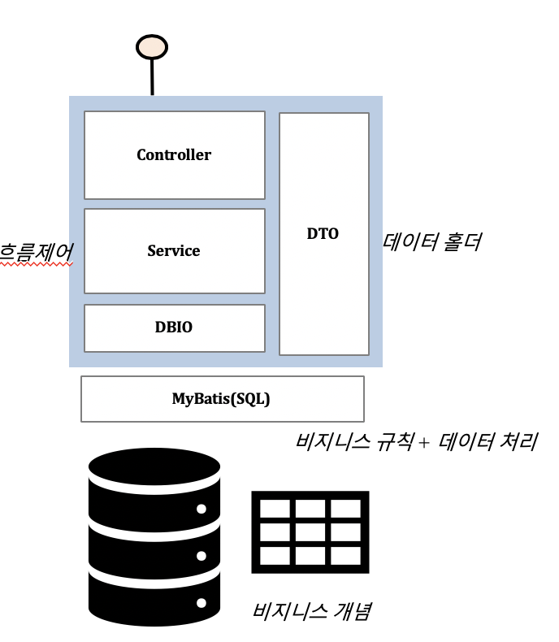
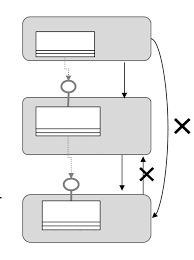
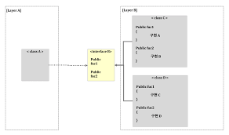

# MSA 아키텍처 

## 1. 데이터베이스 중심 아키테척의 문제점

일반적으로 비즈니스 로직은 서비스에 존재해야 한다고 말하지만 서비스에 존재하게 될 로직은 흐름제어 로직밖에 없다.
그 밖의 비즈니스 개념과 규칙들은 테이블과 SQL 질의에 존재하게되고, DTO는 질의를 통해 가져오는 정보 묶음의 역할밖에 할 수 없다.

이러한 구조는 업무가 복잡해지면 그 복잡성을 제어할 수 없게 되고 특정 DB에 종속적이며, 비즈니스 로직과 SQL 질의가 섞여 표현되기도 한다.

또한 비즈니스 민첩성을 위해서는 유연성과 확장성이 중요한데, 위와 같은 구조에서는 DB를 교체하는 것도 쉽지않다. 이유는 DB와 비즈니스 로직이 끈끈하게 붙어있기 때문에 DB를 교체하려면 전체 소드코드를 손봐야하기 때문이다.

## 2. 레이어드 아키텍처

### 2-1. 규칙
- 상위 계층이 하위 계층을 호출하는 단방향성을 유지한다.
- 상위 계층은 하위의 여러 계층을 모두 알 필요 없이 바로 밑의 근접 계층만 활용한다.
- 상위 계층이 하위 계층에 영향을 받지 않게 구성해야 한다.
- 하위 계층은 자신을 사용하는 상위 계층을 알지 못하게 구성해야 한다.
- 계층 간의 호출은 인터페이스를 통해 호출하는 것이 바람직하다. (구현 클래스에 직접 의존하지 않음으로 약한 결합을 유지해야 한다.)

> 사실 레이어드 아키텍처는 스프링을 사용하면 자연스레 익숙해지는 구조이지만 레이어드 아키텍처는 단순 물리적인 구분이 아니라 논리적인 구분을 중요시한다. 그에 따라 특히 마지막 규칙이 중요한데 잘 지켜지지 않는 경우가 많이 있다. controller -> service 직접 호출하는 경우

위와 같은 방식은 상위 계층이 하위 계층을 호출할 때 인터페이스를 통해 간접 호출함으로써 다양성과 유연성을 보장하고 소스코드 의존성이 구체가 아닌 추상 클래스에 의존하게 된다.

단, 레이어드 아키텍처의 경우 객체지향 특징 중 하나인 개방-폐쇄의 원칙에 위배되는 결과를 낳는데, 이유는 아래와 같다.

상위 계층은 하위 계층의 구체 클래스가 아닌 추상 인터페이스를 통해 접근함으로써 의존성은 줄이고 다형성은 유지되나, 추상 인터페이스는 그 계층이 정의하는 특성의 한계를 벗어날 수 없다.

> 즉 하위 계층이 확장되어 특성이 추가될 때, 닫혀 있어야 할 상위 계층이 하위 계층의 영향을 받을 수 밖에 없다.

위의 그림에서 Layer B의 구현체가 추가되거나 변경되는 경우 비즈니스 로직에는 영향이 없겠지만 데이터 엑세스 계층의 인터페이스 B가 변경이 일어나는 경우 비즈니스 로직도 영향이 생길 수 밖에 없다.

일반적으로 프레젠테이션 영역 / 비즈니스 로직 영역 / 데이터 엑세스 영역 으로 나누었을 때, 비즈니스 로직 영역을 고수준 영역, 나머지 영역을 저수준 영역이라 한다.
고수준 영역은 보호 받아야하고 저수준 영역의 변경이나 확장에 영향을 받지 않아야 한다.
