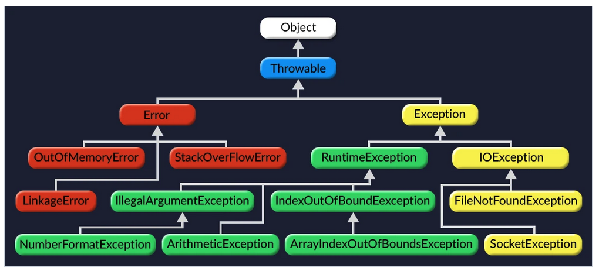

# Java Exception에 대하여

Java에서 Exception은 논리적으로 검사 예외(Checked Exception)와 비검사 예외(UnChecked Exception) 으로 나눌 수 있다.

검사 예외는 Exception을 상속 받는 클래스들 중 RuntimeException을 제외한 클래스들이 대상이다.
비검사 예외는 RuntimeException을 상속 받는 클래스와 Error를 상속 받는 클래스들이 대상이다.

- 검사 예외: 복구할 수 있는 상황(프로그래밍 외적으로 발생항 오류?)
    ex. IOException, SQLException, ClassNotFoundException 등 

- 비검사 예외: 프로그래밍 오류 또는 에러(OOM)와 같이  
    ex. NPE, OOM 등

# 올바르게 예외 처리하는 방법

## 예외는 진짜 예외 상황에만 사용하라
- try-catch 블록 안의 코드는 JVM의 최적화가 제한된다.
- 절대로 일상적인 제어 흐름용으로 사용하지 말자.
- 호출하는 쪽에서 복구하리라 여겨지는 상황이라면 검사 예외를 던져라.
- 프로그래밍 오류를 나타낼 때는 런타임 예외를 사용하자.
- 여러분이 구현하는 throwable은 모두 RuntimeException의 하위 클래스여야 한다. 즉, Error는 상속뿐 아니라 throw 문으로 직접 던지는 일도 없어야 한다.

## 필요 없는 검사 예외 사용은 피하라
- 어떤 메서드가 검사 예외를 던질 수 있는 throwable을 선언했다면 이를 호출하는 코드에서는 catch로 잡아서 처리하거나 더 바깥으로 던지는 작업이 필요하다. 즉, 함부로 throwable을 던지지말자.

## 표준 예외를 사용하라

|종류|설명|
|--|--|
|IllegalArgumentException|허용하지 않는 값이 인수로 건네졌을 때(Null은 NPE로 처리)|
|IllegalStateException|객체가 메서드를 수행하기에 적절하지 않은 상태일 때|
|NullPointerException|null을 허용하지 않는 메서드에 null을 건넸을 때|
|IndexOutOfBoundsException|인덱스가 범위를 넘어섰을 때|
|ConcurrentModificationException|허용하지 않는 동시 수정이 발견됐을 때|
|UnsupportedOperationException|호출한 메서드를 지원하지 않을 때|

> Exception, RuntimeException, Throwable, Error는 직접 재사용하지 말자.

## 추상화 수준에 맞는 예외를 던져라
- 예외 번역
상위 계층에서는 저수준 예외를 잡아 자신의 추상화 수준에 맞는 예외로 바꿔서 던지는 것

~~~java
try {
    ... // 저수준 추상화를 이용한다.
} catch (LowerLevelException e) {
    // 추상화 수준에 맞게 번역한다.
    throw new HigherLevelException(...);
}
~~~

- 예외 연쇄
만약 저수준 예외가 디버깅에 도움이 된다면 고수준 예외에 실어 보내는 것
~~~java
try {
    ... // 저수준 추상화를 이용한다.
} catch (LowerLevelException cause) {
    // 저수준 예외를 고수준 예외에 실어 보낸다.
    throw new HigherLevelException(cause);
}
~~~

> 가능하다면 저수준 메서드가 반드시 성공하도록 하여 아래 계층에서는 예외가 발생하지 않도록 하는 것이 최선이다. 만약, 아래 계층에서 예외를 피할 수 없다면 상위 계층에서 그 예외를 더이상 전파하지 않고 처리하는 것으로 해결할 수도 있다. 단 이때 logging 을 적절히 활용하여 분석이 가능하도록 하자.

## 메서드가 던지는 모든 예외를 문서화하라
검사 예외든 비검사 예외든 문서화 하자.

- 검사 예외는 각 상황을 자바독의 @throws 태그를 사용하여 정확히 문서화하자.(공통 상위 클래스로 뭉뚱그리지 말자.)
- 비검사 예외도 문서화 하자. 단 메서드 선언의 throws 목록에 넣지는 말자. (잘 정리된 비검사 예외 문서는 사실상 그 메서드를 성공적으로 수행하기 위한 전제조건이 된다.)
- 한 클래스에서 많은 메서드가 같은 이유로 같은 예외를 던진다면 그 예외를 각각의 메서드가 아닌 클래스 설명에 추가하는 방법도 있다.

## 예외의 상세 메시지에 실패 관련 정보를 담으라
실패 순간을 포착하려면 발생한 예외에 관여된 모든 매개변수와 필드의 값을 실패 메시지에 담아야 한다.

## 가능한 한 실패 원자적으로 만들라
호출된 메서드가 실패하더라도 해당 객체는 메서드 호출 전 상태를 유지해야 한다.

메서드를 실패 원자적으로 만드는 방법
- 불변 객체로 만드는 것
- 작업 수행 전 매개 변수의 유효성을 검사하는 것
- 실패할 가능성이 있는 모든 코드를 객체의 상태를 바꾸는 코드보다 앞에 배치하는 것
- 객체의 임시 복사본에서 작업을 수행한 다음, 성공적으로 완료되면 원개 객체와 교체하는 것 

## 예외를 무시하지 말라

- catch 문이 비어있는 로직
- 예외를 무시하기로 했다면 catch 블록 안에 그렇게 결정하게 된 이유를 주석으로 명시하고, 예외 변수의 이름도 ignored로 명시하자.