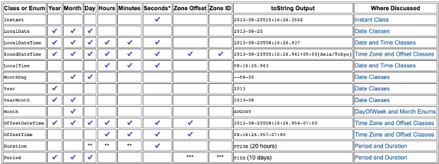

# 개요
글로벌 서비스를 개발함에 있어서 고려해야할 여러가지 사항들 중에 빠질수 없는 것이 바로 시간에 대한 개념이다.

글로벌 서비스를 클라우드 환경에서 제공하게 될텐데 각 서버들은 세계 각국에 흩어져 있고 그에 따라 서비스 시간에 대한 차이가 발생하게 된다. 

또한 UI, 서버, DB 간의 날짜 포맷이 다르게 되면 이를 동기화 하기 위한 작업이 추가로 들어가게 된다.

따라서 이 글에서는 java에서 지원하는 여러 time 포맷들을 알아보고 어떤 식으로 구성하는 것이 좋을까 고찰해볼 것이다.

# 시간을 나타내는 여러 개념 

> **타임존**: 동일한 로컬 시간을 따르는 지역을 의미하며, 일반적으로 국가별로 고유한 타임존을 사용한다. 하지만 미국이나 캐나다 처럼 면적이 넓은 경우 지역별로 타임존을 가지기도 한다. (반면 중국은 넓은 지역에도 불구하고 하나의 타임존을 사용한다.)

> **GMT**: 16세기 후반에 나온 개념으로 한국의 타임존은 GMT+09:00 으로 표현된다. GMT는 Greenwich Mean Time의 약자로서 경도 0에 위치한 영국 그리니치 천문대를 기준으로 하는 태양 시간을 의미한다.

> **UTC**: 20세기 후반에 등장한 개념으로 한국은 UTC+9:00라고 표현한다. 협정 세계시는 1972년부터 시행된 국제 표준시이다. UTC는 태양 대신 원자 시계를 기준으로 하며 전 세계 400여개의 원자시계가 데이터를 비교하며 GMT 오차를 보정해 나가므로 정확도가 더욱 높다. 오차범위가 30만년에 1초?

# Timestamp / DateTime / LocalDateTime / Instant / ZonedDateTime

많은 사람들이 long형 Unix Timestamp(POSIX Time, Epoch Time)을 쓰는 이유는 간단하다.
integer, long type을 이용한 정렬/연산 등에서 다른 타입들보다 빠른 속도를 자랑하기 때문이다.

하지만 Unix Timestamp는 Year 2038 problem을 가지고 있으므로 이것의 대안으로 나온 것이 Java의 Instant 이다.

Instant는 JDK1.8에 java.time 패키지에 들어가 있으며 UTC 타임라인에 있는 순간으로 비즈니스 로직, 데이터 저장 및 데이터 변경 등은 UTC로 이루어져야 한다.

# LocatDate / LocalTime / LocalDateTime
Java Time에서 Local이 들어간다는 것은 시간대(Zone Offset / Zone Region)에 대한 정보가 없다는 의미이다.

다른 나라에서의 시간 값을 맞추기 위해서는 OffsetDateTime 또는 ZonedDateTime을 사용해야 한다.

JDK1.8 이후부터 생긴 Instant 타입을 JDK1.7 이하 버전에서 호환하여 사용하게 될 상황이 생긴다면?
방법이 있다. Instant는 seconds와 nanos로 이루어져 있다.

국제 전기 통신 연합은 협정 세계시에 대한 통일된 약자를 원했으나, 영어권의 사람들과 프랑스어권의 사람들은 각각 자신의 언어로 된 약자인 CUT(Coordinated Universal Time)와 TUC(Temps Universel Coordonné)를 사용하길 원했습니다. 이 분쟁은 결국 두 언어 모두 C, T, U로 구성되어 있다는 것에 착안하여 UTC라는 약어를 탄생시켰습니다. 

디비 서버 타임존

커넥션 세션 타임존

LDT는 객체 자체에 오프셋 개념이 없다.

DB는 UTC로 통일하고 서버는 지역에 맞게 타임존 설정

기본적으로 서버든 DB든 UTC로 통일하는 것이 좋다.
지역한정이라하더라도

이유는 커넥션 타임존만 잡아주면 KST로 알아서 계산 해준다. (ORM 아니더라도 DB 드라이버 자체 기능)

mysql datetime 과 timestamp

datetime: 설정 타임존과 상관 없이 저장된 값을 보여줌
timestamp: 설정 타임존에 맞춰서 보여줌

