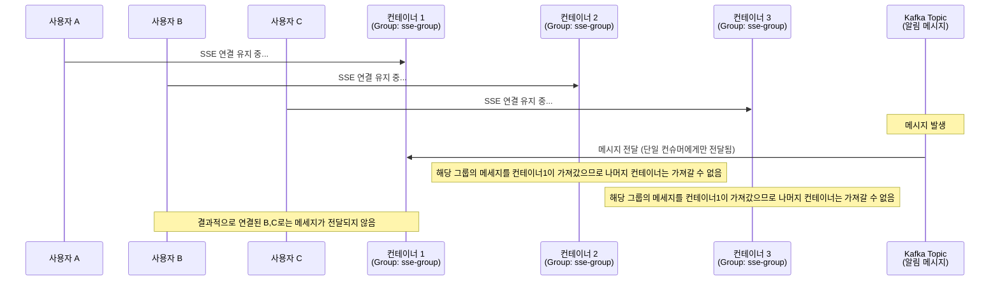
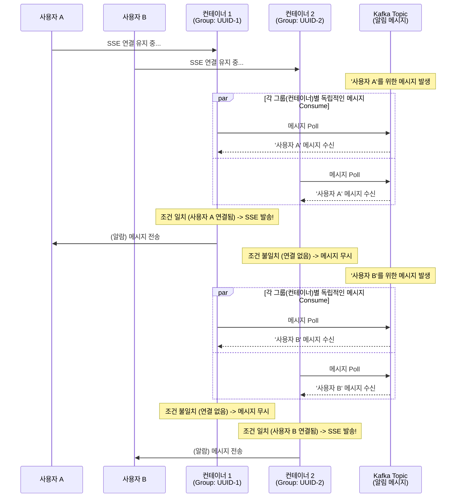
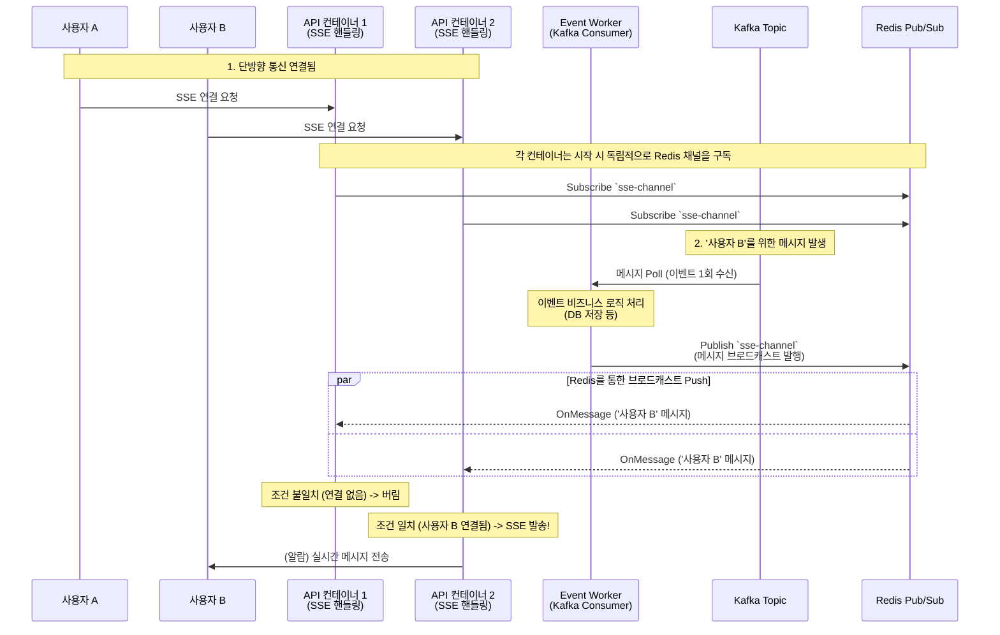

- [SSE pub/sub 문제](#sse-pubsub-문제)
- [SSE pub/sub 문제2](#sse-pubsub-문제2)

# SSE pub/sub 문제

1. kafka만 사용 (groupId가 동일할 때)
- Kafka의 로드 밸런싱 특성: 같은 groupId를 가진 컨슈머들은 파티션을 나눠서 가져감. 즉, 10개의 파티션이 있다면 10개의 컨슈머가 각각 1개씩 가져감.
- 다른 컨테이너는 메세지를 받지 못함 

✅ 해결 방안 1: 컨테이너별 고유 Group ID 사용 (Kafka Broadcast)
각 컨테이너마다 서로 다른 고유한 Group ID(예: UUID 또는 Hostname)를 할당합니다. 이렇게 하면 Kafka는 모든 컨테이너(서로 다른 그룹)에게 동일한 메시지를 복제하여 전달(Broadcast)합니다.

이 방식의 문제점은 SSE 연결마다 Group ID가 다르게 생성되고 카프카 그룹이 과도하게 생성될 우려가 있다는 점입니다.

**카프카 그룹이 무분별하게 많이 생성될 경우 다음과 같은 치명적인 문제점들이 발생합니다:**

1. **Zookeeper / KRaft 메타데이터 부하 (Broker 부하 증가)**
   - Kafka는 각 컨슈머 그룹의 상태와 오프셋을 내부 토픽(`__consumer_offsets`)에 저장하고 관리합니다. 그룹이 지속적으로 생성되면 쓰레기(Garbage) 그룹 메타데이터가 쌓이면서 브로커의 리소스를 점유하고 전체 클러스터 성능을 저하시킵니다.

2. **Rebalance(리밸런싱) 폭풍 (Rebalance Storm)**
   - 컨슈머가 조인하거나 종료될 때마다 그룹 내 파티션 재할당(Rebalance) 작업이 발생합니다. 그룹이 빠르게 생성/삭제되면 브로커가 리밸런싱을 처리하느라 극심한 오버헤드를 겪게 됩니다.

3. **연결(Connection) 및 스레드 고갈**
   - 수많은 생성된 Consumer Group 각각이 브로커와 연결(TCP Connection)을 맺고 메시지를 풀링하기 위한 스레드를 점유하게 됩니다. 결국 브로커의 최대 허용 커넥션 수를 초과하여 장애가 발생할 수 있습니다.

> 💡 **결론:** Kafka의 Consumer Group은 다수의 사용자를 커버하는 소수의 백엔드 서버(인스턴스) 단위로 고정하여 사용해야 합니다. SSE 연결 수천/수만 개마다 Kafka Group을 동적으로 할당하는 것은 브로커를 다운시킬 수 있는 안티패턴(Anti-pattern)입니다. 따라서 다중 서버 SSE 환경에서는 "각 API 컨테이너 단위"로 제한된 그룹만 사용하거나, 실무적으로 더 가벼운 **Redis 권장 사항(Pub/Sub)**을 혼용하는 방식이 권장됩니다.

---

### 3. ✅ 해결 방안 2: Redis Pub/Sub 혼합 구조 (실무 권장사항)

서버(컨테이너) 대수가 매번 확장되거나 변경되는 환경에서는 Kafka 브로드캐스트 대신, 브로드캐스트의 역할을 더 가벼운 **Redis Pub/Sub**에 위임하는 아키텍처가 널리 쓰입니다.

#### Redis Pub/Sub 도입의 장점
1. **가벼운 브로드캐스트 방식:** Redis Pub/Sub은 Kafka처럼 무거운 메타데이터(오프셋, 컨슈머 그룹 등)를 저장하지 않으며 단순히 구독 중인 연결된 소켓으로 메시지를 밀어내는(Push) 초경량 구조입니다.
2. **동적 스케일링에 완벽 대응:** 컨테이너가 100대로 늘어나더라도 각각이 Redis 채널 하나만 구독하면 되기 때문에 리밸런싱 지연이나 연결 스레드 고갈 문제가 발생하지 않습니다.
3. **책임 분리:** Kafka는 "이벤트의 영구 저장과 무결성 및 순차 보장"이라는 본연의 목적에 충실하고, Redis는 "가벼운 휘발성 브로드캐스트(실시간 알림)" 에 특화되어 시스템 안정성이 높아집니다.

#### Redis Pub/Sub 혼합 도식화

# SSE pub/sub 문제2