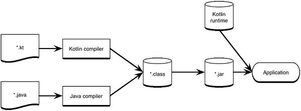
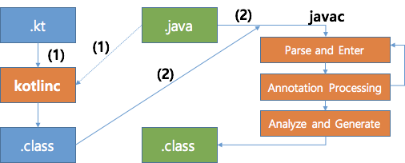

# basic

- MultiPlatform
: 다양한 플랫폼용 어플리케이션을 만들고 네이티브 프로그래밍의 이점을 유지하면서 플랫폼 전체(iOs, Android, macOS, Windows, Linux 등)에서 코드를 효율적으로 재사용할 수 있다.

> 품질 저하 없이 코드 공유
공유 Kotlin 코드는 플랫폼 바이너리로 컴파일되어 모든 프로젝트에 원활하게 통합됩니다. 플랫폼별 API를 활용할 수 있는 언어 기능과 함께 더 이상 네이티브 개발과 크로스 플랫폼 개발 사이에서 결정할 필요가 없습니다. 두 세계의 장점을 동시에 누릴 수 있습니다!

- Server-side
- Multiplatform libraries
- Android

# java + Spring Boot 프로젝트에 kotlin 서비스 도입시 주의사항

- lombok 컴파일 오류
~~~java

// lombok 사용
@Getter
@AllArgsConstructor
public class Person {

    Person(String name, int age) {
        this.name = name;
        this.age = age;
    }

    @Getter
    private String name;

    @Getter
    private int age;
}

// lombok 사용 컴파일
public class Person {

    Person(String name, int age) {
        this.name = name;
        this.age = age;
    }

    @Getter
    private String name;

    @Getter
    private int age;
}

// Kotlin
fun printName() {  
    val person = Person("Bob", 30)
    println(person.name) // Error: Cannot access 'name': it is 'private' in "Person"
}
~~~

문제는 java 와 kotlin 코드가 섞여있는 프로젝트의 빌드 과정을 살펴봐야 한다. 

# compile 

1. kotlin 컴파일러가 .kt 파일을 .class 파일로 생성한다.
2. 1의 과정에서 kotlin 코드가 참조하는 .java 파일이 함께 로딩되어 사용된다.
3. java 컴파일러가 .java 파일을 .class 파일로 생성한다.
4. 3의 과정 중 Annotation Processing 단계에서 lombok이 코드를 생성한다.
5. 하지만 4의 단계에는 이미 kotlin 코드가 컴파일된 이후이기 때문에 kotlin은 lombok이 사용한 코드를 사용할 수 없다.

해결 방법

1. kotlin보다 java 코드를 먼저 컴파일 하도록 빌드 순서를 조정한다.
- 하지만 java 코드에서 kotlin 코드를 호출할 수 없다.

2. java와 kotlin 모듈을 분리한다.
- 상호간의 호출이 불가능해진다.

3. 빌드 전처리 과정에서 lombok이 제공하는 delombok 기능을 활용해 미리 코드를 생성하게 한다.
- gradle이 공식 플러그인을 지원하지 않아서 빌드 구성이 복잡해진다.

4. lombok이 적용된 코드를 kotlin의 data class로 변환
- 일괄 변환이 안정성 측면에서 부담이 될 수 있다.

5. lombok 제거

