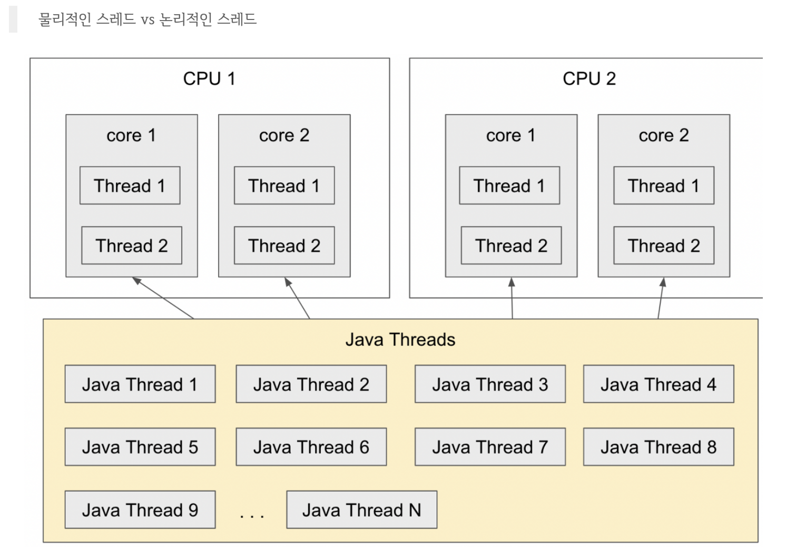

# reactor

## thread

### 물리 스레드
물리적인 코어가 가지는 논리적인 스레드 수
1코어는 2스레드를 가진다.

### 논리 스레드
소프트웨어적으로 생성되는 thread로 이론적으로 메모리가 허용하는 한 무한대로 만들수 있다.

> 물리 스레드는 병렬성과 관련이 있고, 논리 스레드는 동시성과 관련이 있다.

## Scheduler
운영체제 레벨에서의 Scheduler는 실행되는 프로세스의 라이프 사이클을 관리해주는 역할을 한다.

Reactor에서 Scheduler는 비동기 프로그래밍을 위해 사용되는 스레드를 관리하는 역할을 한다.
이는 스레드의 제어를 대신해주기 때문에 코드가 간결해지고 스레드 제어의 부담을 개발자가 가지지 않아도 된다.

### Scheduler Operator

- subscribeOn()
구독이 발생한 직후 실행될 스레드를 지정하는 Operator이다. 원본 Publisher의 동작을 수행하기 위한 스레드라고 볼 수 있다.
.subscribeOn(Schedulers.boundedElastic()

> Schedulers.immediate(): 스케쥴러가 필요하지만 쓰레드를 변경하고 싶지 않을 때
Schedulers.single(): 일회성으로 사용하려고 쓰레드풀을 만들 때
Schedulers.parallel(): 병렬로 여러 태스크를 처리할 때(cpu에 의존하지만 짧은 태스크 처리용), 쓰레드풀 크기는 고정됨
Schedulers.elastic(): 긴 태스크에 대해 IO blocking이 발생할 때
Schedulers.boundedElastic(): elastic과 비슷하지만 쓰레드풀의 크기를 제한함. 입출력 작업에 적합함 - 추천

> Thread pool에 비유하자면,
immediate는 쓰레드 풀을 아예 만들지 않는 것
single은 1개짜리 쓰레드 풀을 만든 것
parallel과 elastic은 무제한으로 쓰레드를 만들 수 있는 쓰레드 풀을 만든 것(보통 이런 걸 쓰레드 풀이라고 하진 않음)
parallel은 짧게 사용하는 쓰레드 풀
elastic은 길게 사용하는 쓰레드 풀
boundedElastic은 길게 사용하는 쓰레드 풀인데 갯수 제한이 있는 것(진정한 의미의 쓰레드 풀에 해당함)

- doOnNext()
원본에서 emit되는 데이터를 로그를 출력한다. 

- doOnSubscribe()
구독이 발생한 시점에 추가적인 어떤 처리가 필요한 경우 동작을 추가할 수 있다.
가장 먼저 실행된다. main 스레드에서 실행한다. 

- publishOn()
Downstream으로 Signal을 전송할 때 실행되는 스레드를 제어하는 역할을 하는 Operator이다. 

